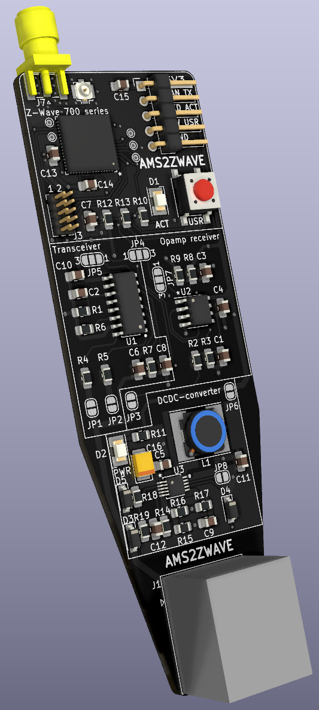

# AMS2ZWAVE
Converter for Norwegian EMI HAN interface to Z-Wave

# Disclaimer
This is a hobby project, and as such will be supported if and when I have the time.

The project is assumed to work for my situation, but it might not work for you. Use at your own risk.

Furthermore, since I am not a member of the Z-Wave SDO, there is no manufacturer/product ID officially assigned to this device.
I don't have the funds required to certify this device, nor the wish to do so myself. This means the IDs in use in this firmware can
be assigned to another manufacturer at any given point in time, breaking the operation of this device in hubs that utilize
device databases (which would be all of them given device configuration parameters are not always discoverable on the network).

Or, more likely, there will be other hobby projects that choose to use the same ID as the default in here.
In that case, you'll have to recompile one of them yourself with a different ID to avoid collisions if they're to be used against the same hub.

If you are affiliated with an SDO-registered company and wish to take this design to market, feel free to do so. I'd appreciate a heads-up, though.

# License
Hardware design is licensed CC-BY: https://creativecommons.org/licenses/by/4.0/

The Z-Wave application code is adapted from a sample application [supplied by Silicon Labs on Github](https://github.com/SiliconLabs/z_wave_applications/tree/1341a074053843d77aac94dc1ba609a796c5856e/z_wave_gesture_sensor_wall_controller_application). The sample applications in that repository are licensed under the Zlib license, and so are my modifications.

Other files that do not originate from the sample application (notably my own HAN parser), are also licensed under the Zlib license.

# Hardware

[PDF Schematic](CAD/AMS2ZWAVE.pdf)

Schematic and board layout are done in KiCAD, and source files can be found in the `CAD` folder.
[Production files for my prototype order](CAD/Gerber/ams2zwave_v1.zip) are also supplied.

## Choice of Z-Wave circuit
I consider this design to be hand-solderable, with the exception of the ZGM130S System-in-Package. Until a Z-Wave 700 series module is
designed and brought to market with a more hobbyist-friendly form factor, you'll have to use a stencil and solder paste to reflow that part.

For prototyping purposes, this design also contains a header to allow it to be wired up to a development kit, instead of having to solder down the ZGM130S.
In that case, the design will act as a bus level translator, power supply and user interface.
For a Silicon Labs WSTK (BRD4001) with ZGM130S plug-in card (BRD4202), wire the `J4` header as follows to the WSTK's `EXP` header:

| Signal | J4  | EXP | ZGM130S |
| ------ | --- | --- | ------- |
| VMCU   | 1   | 2   | (A)VDD(IO) |
| GND    | 5   | 1   | GND |
| HAN_TX | 2   | 6   | PC7 / USART1_RX |
| LED1   | 3   | 13  | PF3 |
| BTN1   | 4   | 9   | PF7 |

## Choice of bus level translation
Norwegian HAN is M-Bus with a twist: all meters observed to date supply 24V 'at rest' (space).
[Mark signal should be 12V under the space voltage](https://m-bus.com/documentation-wired/04-physical-layer), so with that in mind, I have prototyped
two different circuits for converting the HAN signal level to 3V3 TTL.

### Dedicated IC
The 'transceiver' circuit uses an m-bus transceiver, but foregoes using its internal LDO for powering the Z-Wave circuit in favor of a separate DCDC. Avoiding
using the LDO allows the circuit to be much more efficient and not trip any overcurrent protections in the HAN bus master implementation.

Using a transceiver is a more expensive solution, but should also be more reliable in case another meter appears that decides to use actual M-bus voltages (+36/+24)
instead of the currently observed de-facto +24/+12 signal.

Pin-compatible devices are TI's TSS521/TSS721 or ON Semi's NCN5150.

### Opamp
A cheaper alternative (but needs to be validated that it works) is a comparator circuit driven off of the 3V3 supply, looking at the HAN signal through a simple
voltage divider. The resistor values specified would divide the input signal by 12 (i.e. 2V space, 1V mark) and put the reference voltage at 1.75V.

### Setting the jumpers

| Jumper | Function | Default setting (uncut/unsoldered) |
| ------ | -------- | ---------------------------------- |
| JP6 | Connect DCDC output to 3V3 line | connected |
| JP1 | Connect HAN port input 1 to transceiver circuit | unconnected |
| JP2 | Connect HAN port input 2 to transceiver circuit | unconnected |
| JP3 | Connect HAN port input to opamp circuit | unconnected |
| JP5 | Select between normal (1) or inverted (3) transceiver output | normal |
| JP7 | Select between normal (1) or inverted (3) opamp output | normal |
| JP4 | Select source of `HAN_TX` signal between transceiver (1)(output of `JP5`) and opamp (3)(output of `JP7`) circuit  | transceiver / JP5 |

Of note: this circuit won't give you any signal by default. You need to choose to either use the transceiver-based circuit for level translation by soldering
jumpers `JP1` and `JP2`, or select the opamp circuit by soldering `JP3` and moving `JP4` from its default 1-2 position to 2-3.

## DCDC converter and power consumption
The DCDC converter is based around a MAX17531 step-down converter, and designed according to [the datasheet's figure 7](https://datasheets.maximintegrated.com/en/ds/MAX17531.pdf),
*High-Efficiency 3.3V, 50mA Regulator*. Under normal operation, the device will draw about 10 - 14 mA from the 3V3 line, meaning it will be operating at
about 85% efficiency.

This results in a top power draw of about 50mW from the HAN interface (plus the transceiver circuit's static current draw), which is well within spec
for all of the currently deployed meters in Norway. The lowest-power ones (Kamstrup meters) are spec'ed to supply 144mW / 6mA continuously.

## Z-Wave circuit
The circuit was designed based off of the Silicon Labs reference design boards (BRD4202A and BRD8901A, available in Simplicity Studio). Due to the nature
of the SiP, the core design is *extremely* lightweight: 2 decouple caps and an antenna connector. The distance between the SiP and the connector is so short
vs. the wavelength, that impedance control is unlikely to make a difference. The SiP's output is already matched to 50 ohm, so as long as the connected antenna
is also matched to 50 ohms, the design should be good to go.

Debug connector is a 0.05" pitch, 2x5 pinheader. The pinout matches the 'mini simplicity' connector described in Silicon Labs' [application note AN958](https://www.silabs.com/documents/public/application-notes/an958-mcu-stk-wstk-guide.pdf).
This makes it so that the circuit can be debugged by a Silicon Labs development kit [with the appropriate adapter](https://www.silabs.com/development-tools/mcu/32-bit/simplicity-debug-adapter), or
really any other SWD debug probe with the 10-pin ARM connector. Using the Silicon Labs kit gives the possibility to trace energy usage and have a debug serial port
from inside the IDE, though.

The button and activity LED are routed to the same pins as in the Z-Wave SDK's reference applications.

The HAN signal is routed to the Z-Wave SDK's reference application 'USART 1' RX pin. It's a 2400 baud 8-N-1 signal.

# Software
The software is an adaptation of the ['Gesture Wall Controller' Z-Wave sample app](https://github.com/SiliconLabs/z_wave_applications/tree/master/z_wave_gesture_sensor_wall_controller_application).

Changes include:
* Stripped out 'central scene' CC and dependencies
* Stripped out associations that are not the lifeline group
* Implemented 'meter' CC
* Changed device type to 'generic meter'
* Bogus manufacturer/product ID
* Implemented a parser for the HAN signal:
    * Uses list identifiers to parse the incoming information. This means a firmware update would be required to support any new meters appearing on the Norwegian market. Shouldn't be much of an issue, since the firmware does support OTA updates.
    * Lives in a [separate repository](http://github.com/stevew817/ams-han-parser)
* Implemented configuration CC to support changing the reporting frequency

Todo:
* Add separate endpoints for getting phase-specific values on three-phase meters (root endpoint reports total values).

To build the firmware:
1. Download and install Simplicity Studio
2. Install the Z-Wave SDK inside Simplicity Studio (project was created with Z-Wave SDK 7.15.x)
3. Import this repository (including submodules) as a project into Simplicity Studio
4. Build
5. Run or debug on target from within Simplicity Studio using a supprted debug probe (J-Link)

## Z-Wave operation
Device only has a single association group, which is the lifeline group. It will report meter updates unsolicited to the node registered to the lifeline group.
Frequent updates report power draw, whilst the accumulated meter reading is only reported once an hour (see the HAN standard from NEK).

The controller can ask ('poll') for other values (like voltage and current), but there is currently no support for reporting these automatically.
I consider the use case for grabbing these values fairly narrow, since line voltage shouldn't deviate from 230V too much, and you can calculate backwards from
the reported power draw to get a 'good-enough' estimation of current.

## Development
The root of this repository is importable as a Simplicity Studio project, and targets the Z-Wave SDK version 7.15.4. Both Simplicity Studio and the Z-Wave SDK
are free downloads after registering with Silicon Labs.
